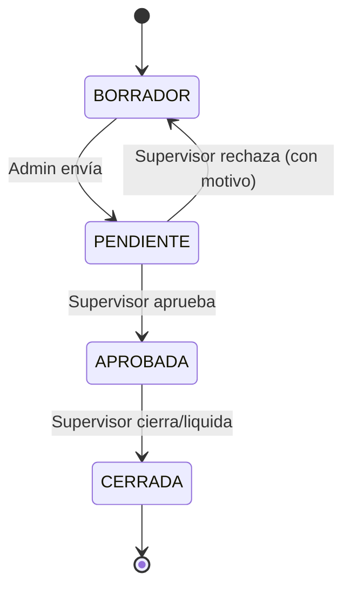

# SRS / PRD — Reestructura PayrollTool · Fletes Sotelo

| Campo | Valor |
|---|---|
| Proyecto | PayrollTool · Fletes Sotelo |
| Documento | 01 — SRS / Product Requirements |
| Versión | 1.0 |
| Estado | En revisión |
| Fecha | 2026-06-11 |
| Autor | David García |
| Revisores | Cliente (Fletes Sotelo / nómina), Equipo de desarrollo |
| Depende de | [02_reglas_negocio_supuestos](02_reglas_negocio_supuestos.md), [07_roadmap_fases](../07-roadmap/07_roadmap_fases.md) |

---

## Roles del sistema y máquina de estados

**Roles** (detalle de permisos en el doc 04): **Admin** (administra y opera la nómina: **carga el CSV de Genesis**, captura y recálculo), **Operador** (conductor: **solo consulta el seguimiento de sus propios viajes**), **Supervisor/Aprobador** (aprueba/rechaza/cierra), **Auditor** (solo lectura global + bitácora).

**Máquina de estados de una liquidación:**

> Segregación de funciones: quien **carga y captura** (Admin) y quien **aprueba/cierra** (Supervisor) son responsabilidades separadas (control anti-fraude). El **Operador (conductor)** no participa en el flujo: solo consulta **sus** viajes.

---

## Problema

El sistema actual procesa nómina foránea (CSV de Genesis → cálculo de pagos por viaje), pero presenta tres clases de problemas que impiden operarlo con confianza y escalarlo:

1. **Errores de cálculo confirmados** (documento *Ajustes Sotelo*): el total ignora el diésel a favor, los cruces se pagan doble, conceptos que no deben pagar base (Tri, GT, rutas base) sí lo hacen, el rendimiento de diésel es global cuando debe ser por viaje, y el filtrado por semanas rígidas rompe los viajes que cruzan periodos. En nómina, un error de cálculo no es un bug menor: es dinero mal pagado.
2. **Falta de control de acceso:** no existe sistema de usuarios, roles ni permisos. Cualquiera con la URL puede operar el sistema completo, incluidos los catálogos que alimentan los cálculos.
3. **Fragilidad estructural:** la base de datos no modela usuarios, no normaliza boletas/viajes, y el frontend (`BoletaCard.jsx`) **recalcula totales con fórmulas propias** que ya divergen del backend (ej. Bono Doble en $1,726 en frontend vs $2,439 en backend). No hay tests automatizados de la lógica de nómina.

## Objetivo

Entregar una versión reestructurada del sistema que:

- Calcule la nómina de forma **exacta y verificable**, con el backend como **fuente única de verdad** y cobertura de pruebas contra nóminas reales pagadas.
- Incorpore **control de acceso por roles** (Admin, Operador, Supervisor/Aprobador, Auditor) y un **panel administrativo completo** sobre el existente.
- Robustezca la base de datos MySQL (integridad, normalización, auditoría) **sin pérdida de datos ni interrupción**.
- Mantenga la identidad visual actual, mejorando usabilidad y accesibilidad.

### Métricas de éxito

| Métrica | Línea base | Meta |
|---|---|---|
| Exactitud de cálculo vs nóminas reales de control | No medida | **100% de coincidencia** en el set de regresión |
| Cobertura de pruebas de la lógica de nómina (Libraries) | 0% | **≥ 90%** de líneas en `PayrollCalculator`/`BoletaProcessor` |
| Divergencias frontend↔backend en totales | ≥ 1 conocida | **0** (frontend consume total del backend) |
| Acciones sin control de acceso | 100% | **0** (toda ruta sensible protegida por rol) |
| Tiempo de cierre de una liquidación (Admin/nómina) | No medido | Establecer línea base y reducir tras UX |
| Defectos de cálculo en producción post-release | — | **0 críticos** por trimestre |

## Usuarios objetivo

| Usuario | Rol en el sistema | Necesidad principal |
|---|---|---|
| Administrador / nómina | **Admin** | **Subir el CSV de Genesis**, capturar diésel/bonos por viaje, revisar y recalcular boletas, gestionar usuarios, catálogos (tabulador, rutas, keywords, rendimientos), exclusiones y reglas |
| Encargado de nómina / supervisor | **Supervisor/Aprobador** | Revisar, aprobar o rechazar liquidaciones antes de cerrarlas |
| Conductor (operador de unidad) | **Operador** | **Consultar el seguimiento de sus propios viajes** y su liquidación (solo lectura, acotado a su unidad) |
| Contabilidad / auditoría | **Auditor** | Consultar liquidaciones, reportes y bitácora sin poder modificar |

## Solución propuesta

Una evolución incremental del sistema actual en **6 fases** (ver `02_Roadmap_Fases.md`):

- **Capa de identidad y acceso:** usuarios + RBAC (roles y permisos), autenticación, filtros CI4 por rol.
- **Capa de datos robusta:** normalización de liquidaciones/boletas/viajes, catálogos versionados, tabla de exclusiones administrable, captura de diésel por viaje, auditoría ampliada.
- **Motor de cálculo corregido:** los 5 ajustes de *Ajustes Sotelo*, backend como fuente única, suite de pruebas de regresión.
- **Panel administrativo extendido:** gestión visual de catálogos, usuarios, exclusiones y flujo de aprobación.
- **Frontend mejorado:** mismo lenguaje visual, mejor jerarquía, estados, validación y accesibilidad (WCAG AA).
- **Endurecimiento y corte a producción:** migración con credenciales productivas, despliegue y monitoreo.

## User Stories principales (resumen — detalle en backlog)

- Como **Admin**, quiero subir el CSV de Genesis y capturar el precio de diésel por viaje, para liquidar con el rendimiento real de cada viaje.
- Como **Admin**, quiero que el total de la boleta sea exactamente *pago base + diésel a favor*, para no pagar de menos ni de más.
- Como **Operador (conductor)**, quiero ver el seguimiento de mis propios viajes y mi liquidación, para conocer mi pago sin poder modificar nada.
- Como **Supervisor**, quiero aprobar o rechazar una liquidación, para que ningún pago salga sin revisión.
- Como **Admin**, quiero administrar la lista de exclusiones (Tri, GT, rutas base), para corregir el pago base sin tocar código.
- Como **Auditor**, quiero ver la bitácora de cambios, para rastrear quién modificó qué y cuándo.
- Como **cualquier usuario**, quiero iniciar sesión y ver solo lo que mi rol permite, para proteger los datos y los catálogos de cálculo.

## Fuera del scope (de esta reestructura)

- App móvil nativa.
- Integración automática (API) con Genesis (se mantiene la carga por CSV).
- Cálculo automático del diésel/bono de desempeño (se mantiene **manual-only** por política vigente del cliente — ver RULE_LEDGER §B).
- Migración a otro motor de BD (se confirmó **mantener MySQL**).
- Reescritura del frontend a otro framework (se mantiene React + Vite).

## Dependencias

- **Cliente (Fletes Sotelo):** confirmar las 4 decisiones de negocio bloqueantes (`05_Reglas_Negocio_Supuestos.md`) y proveer nóminas reales pagadas como set de control.
- **Infraestructura:** credenciales de la BD de producción (`nomina-sotelo.dataholics.com.mx`) para la fase de corte; acceso al entorno de despliegue.
- **Equipo:** 1 desarrollador full-stack (estimación base); QA para la fase de regresión.

## Timeline estimado

| Fase | Entregable | Estimación |
|---|---|---|
| Fase 0 | Fundaciones (Docker, BD prueba, CI, tests baseline) | ~1 semana |
| Fase 1 | BD robusta + Auth + RBAC (backend) | ~2 semanas |
| Fase 2 | Ajustes de lógica + tests (bloqueada por decisiones) | ~2–2.5 semanas |
| Fase 3 | Panel administrativo + RBAC (frontend) | ~2 semanas |
| Fase 4 | Mejora UI/UX | ~1.5 semanas |
| Fase 5 | Endurecimiento + corte a producción | ~1 semana |

**Total estimado: ~9.5 a 10.5 semanas** con un desarrollador (las Fases 0–1 pueden solaparse parcialmente con la confirmación de decisiones de negocio).
